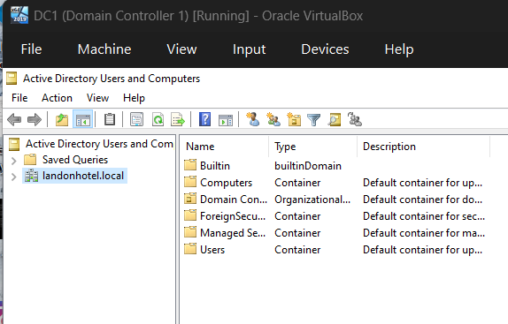
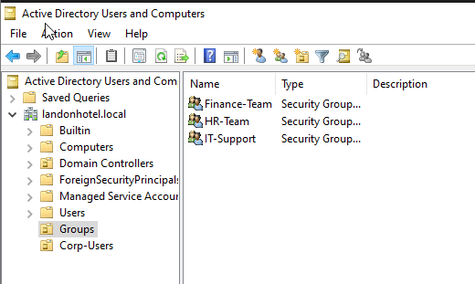
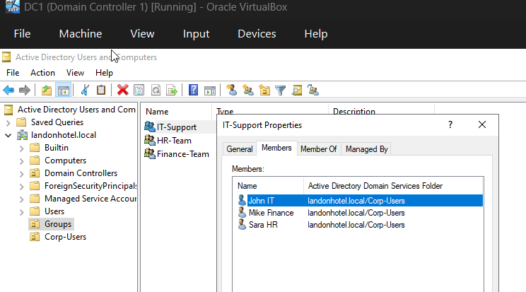

# Project 02 – User & Group Management (Active Directory)

## Project Summary
This project focused on provisioning domain user accounts and implementing role-based access control (RBAC) using Active Directory **Security Groups** in the **landonhotel.local** environment.

---

## Environment
- Operating System: Windows Server 2022
- Hypervisor: VirtualBox
- Domain: landonhotel.local
- Domain Controller: DC-1
- Tool Used: Active Directory Users and Computers (ADUC)

---

## Objective
To simulate enterprise user onboarding by creating domain users, creating department security groups, assigning users to the correct groups, and validating group membership.

---

## Lab Tasks Completed

### 1) Open ADUC and Verify Domain
Opened Active Directory Users and Computers (ADUC) and confirmed the domain structure.

---

### 2) Create Organizational Units (OUs) for Clean Administration
Created the following OUs at the domain root:
- `Groups`
- `Corp-Users`

> Note: The default **Users** container already exists in Active Directory by design, so a separate OU named **Corp-Users** was created to support better administration and future Group Policy linking.

*(No screenshot required — structure is shown in later screenshots.)*

---

### 3) Create Security Groups (Global + Security)
Created department-based security groups inside the **Groups** OU:
- IT-Support
- HR-Team
- Finance-Team

---

### 4) Create Domain Users
Created onboarding domain user accounts inside the **Corp-Users** OU:
- John.IT
- Sara.HR
- Mike.Finance

---

### 5) Assign Users to Groups (RBAC)
Assigned users to their respective department groups:
- John.IT → IT-Support
- Sara.HR → HR-Team
- Mike.Finance → Finance-Team

---

## Validation Check
Validated user group membership using the **Member Of** tab on the user object.

---

## Result
Users and security groups were successfully created and configured. Group membership was verified, demonstrating proper identity provisioning and RBAC implementation in **landonhotel.local**.

---

## Skills Demonstrated
- Active Directory user provisioning
- Security group creation (Global/Security)
- Group membership management (RBAC)
- Identity administration and validation (Member Of verification)

---
