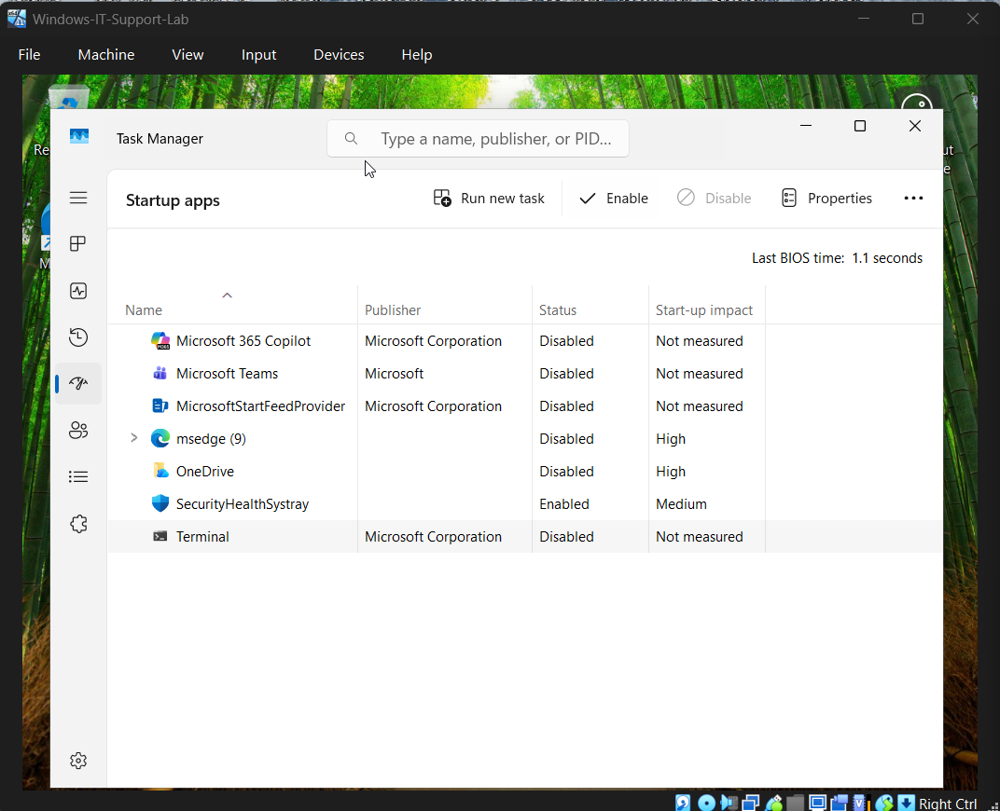

# Ticket 03 – System Running Slow & Delayed Startup

## Issue Summary
A user reported that their system was running slowly and applications were taking a long time to open, particularly after system startup.

---

## Environment
- Operating System: Windows 10 / 11
- Device Type: User Workstation
- Issue Type: Performance degradation

---

## User Problem
The system performance was noticeably slow, and startup time was significantly delayed. Applications were also slow to respond after login.

---

## Questions Asked
To better understand the issue, the following questions were asked:

- When did the performance issue start?
- Is the slowness constant or only after startup?
- Were there any recent software installations or updates?
- Does the system freeze or just respond slowly?

---

## Checks Performed
The following diagnostic checks were conducted:

- Reviewed CPU, memory, and disk usage via **Task Manager**
- Identified unnecessary startup applications
- Checked available disk space
- Reviewed temporary files and system clutter

---

## Root Cause
Excessive startup applications and high background resource usage were impacting system performance and causing delayed startup.

---

## Resolution Steps

1. Opened **Task Manager**
2. Analyzed CPU, Memory, and Disk utilization
3. Navigated to the **Startup** tab
4. Identified non-essential startup applications
5. Disabled unnecessary startup programs
6. Performed **Disk Cleanup** to remove temporary files
7. Restarted the system to apply changes

---

## Evidence

### High Startup Resource Usage

### Disabled Startup Applications

### Disk Cleanup Process

---

## Result
System performance improved significantly. Startup time was reduced, and applications responded faster after login.

---

## Prevention / Best Practices

- Limit startup applications to essential software only
- Perform regular disk cleanup
- Monitor system resource usage periodically
- Avoid installing unnecessary background software

---

## Tools Used

- Task Manager
- Startup Applications Manager
- Disk Cleanup Utility
- File Explorer
