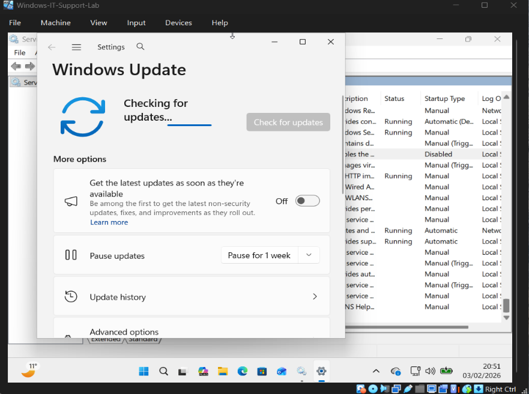
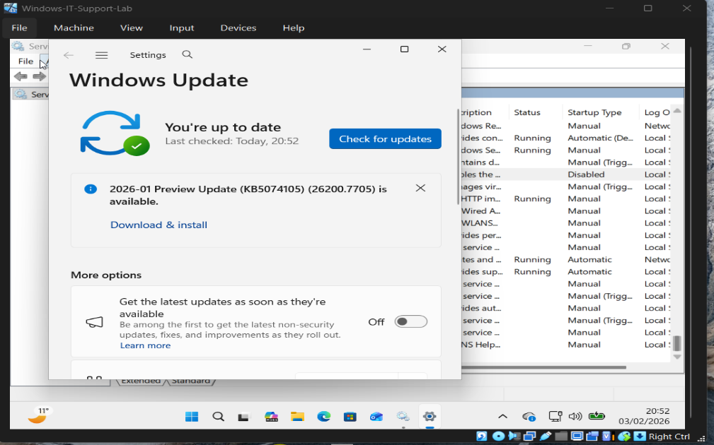

# Ticket 05 – Windows Updates Not Installing (Paused Updates)

## Issue Summary
A user reported that Windows updates were not downloading or installing on their system.

---

## Environment
- Operating System: Windows 10 / 11
- Update Service: Windows Update
- Device Type: User Workstation

---

## User Problem
The user noticed that the system was not receiving or installing Windows updates, which prevented the device from staying up to date.

---

## Questions Asked
To identify the issue, the following questions were asked:

- When did the update issue start?
- Is the system showing any error messages?
- Has the system been restarted recently?
- Were updates intentionally paused?

---

## Checks Performed
The following troubleshooting checks were conducted:

- Checked Windows Update status in **Settings**
- Reviewed update history
- Verified update configuration
- Identified that Windows updates were paused

---

## Root Cause
Windows updates were paused in system settings, preventing the system from checking for and installing updates.

---

## Resolution Steps

1. Opened **Windows Settings**
2. Navigated to **Update & Security**
3. Accessed **Windows Update**
4. Identified that updates were paused
5. Clicked **Resume Updates**
6. Rechecked for updates to confirm functionality

---

## Evidence

### Windows Update Paused

### Updates Resumed

### Update Check Successful

---

## Result
Windows Update functionality was restored, and the system successfully checked for and downloaded updates.

---

## Prevention / Best Practices

- Avoid pausing updates unless required
- Resume updates after temporary pauses
- Perform regular system maintenance
- Ensure systems remain up to date for security

---

## Tools Used

- Windows Update Settings
- Windows Settings Application
