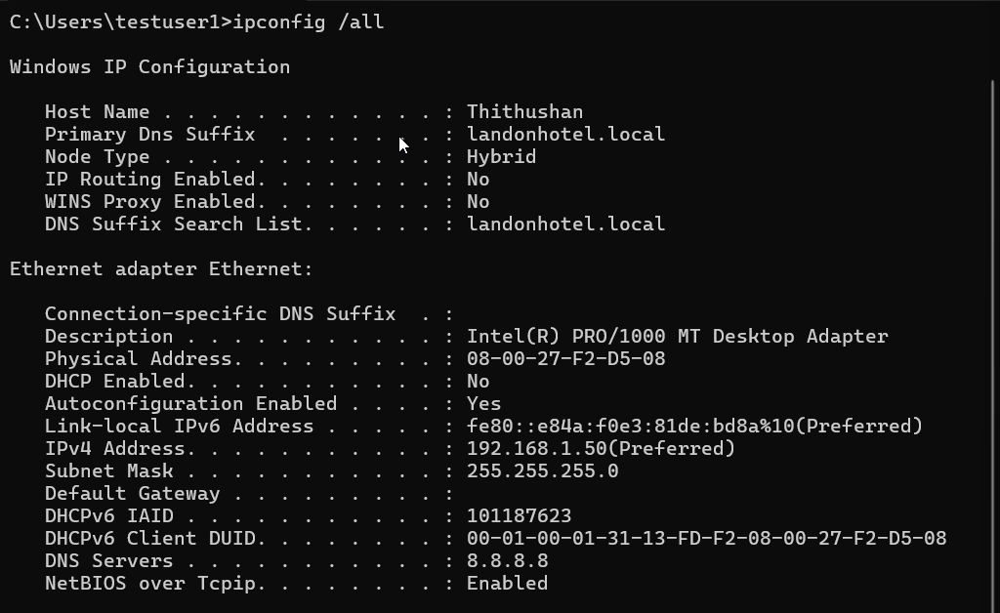
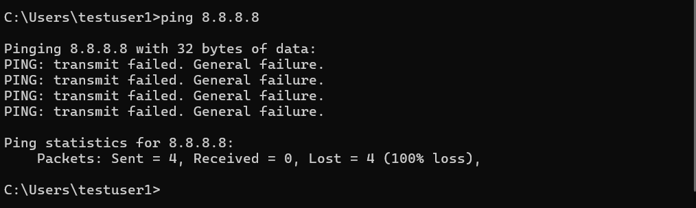
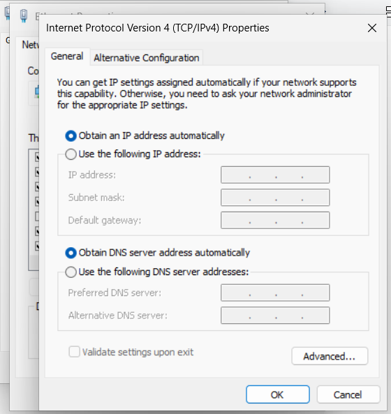
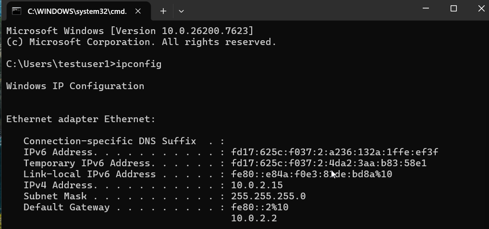

# Ticket-05 — No Internet Connectivity (Domain-Joined Workstation)

## Objective
Diagnose and resolve a workstation issue where the system was unable to access the internet due to incorrect TCP/IP configuration.

---

## Lab Environment

- Hypervisor: VirtualBox
- Client OS: Windows 11 (VM)
- Domain Status: Domain-Joined (landonhotel.local)
- Logged-in User: Local Account (`.\testuser1`)
- Account Created Under: Local Administrator (Thithushan)
- Network Type: NAT / Internal Network
- Tools Used: Command Prompt, Network Adapter Settings

---

## Issue Summary

A workstation user reported that the computer was unable to access the internet. Troubleshooting was performed locally on the domain-joined machine to identify whether the issue was caused by IP misconfiguration, DNS failure, or routing problems.

---

## Steps Performed

### 1) Simulate Network Failure

- Opened Network Adapter Settings  
- Accessed IPv4 Properties  
- Configured static IP without Default Gateway  

**Configuration Applied:**

IP Address: 192.168.1.50  
Subnet Mask: 255.255.255.0  
Default Gateway: (Blank)  
DNS Server: 8.8.8.8  

**Screenshots:**

---

### 2) Verify IP Configuration

Executed:

`ipconfig /all`

Observed that the workstation had a static IP assigned but no Default Gateway configured, preventing external network routing.

**Screenshots:**

---

### 3) Test Internet Connectivity

Executed:

`ping 8.8.8.8`

Result: Transmission failed due to missing external routing path.

**Screenshots:**

---

## Root Cause

The workstation’s TCP/IP configuration did not include a Default Gateway. Without a configured gateway, external routing was not possible, preventing internet connectivity.

---

## Resolution Steps

### 4) Restore Network Configuration

- Reopened IPv4 settings  
- Enabled DHCP configuration  

Settings applied:

Obtain IP address automatically  
Obtain DNS server address automatically  

**Screenshots:**

---

### 5) Verify Connectivity Restoration

Executed:

`ipconfig`  
`ping 8.8.8.8`

Observed successful replies and valid gateway assignment, confirming restored connectivity.

**Screenshots:**

---

## Validation

- Verified Default Gateway assignment  
- Confirmed external IP connectivity  
- Confirmed successful packet transmission  

---

## Outcome

Successfully diagnosed and resolved the internet connectivity issue by correcting TCP/IP configuration and restoring Default Gateway routing on the workstation.
