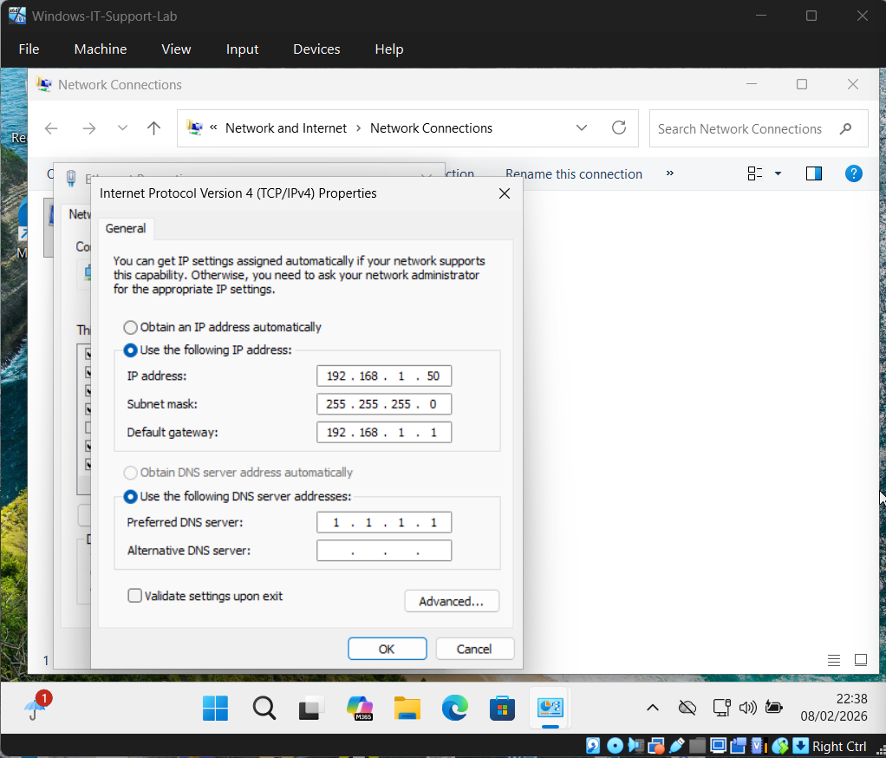
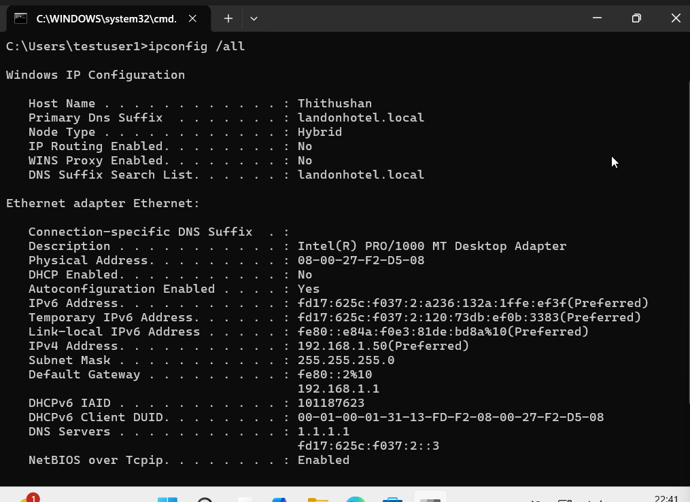
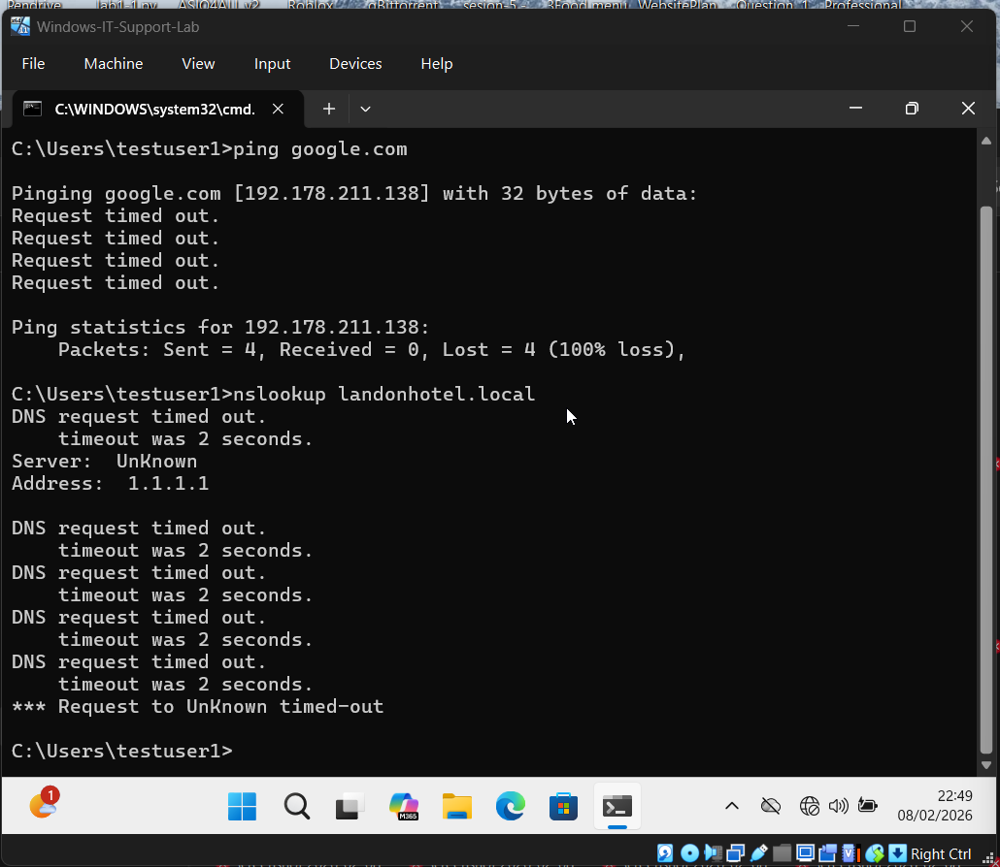
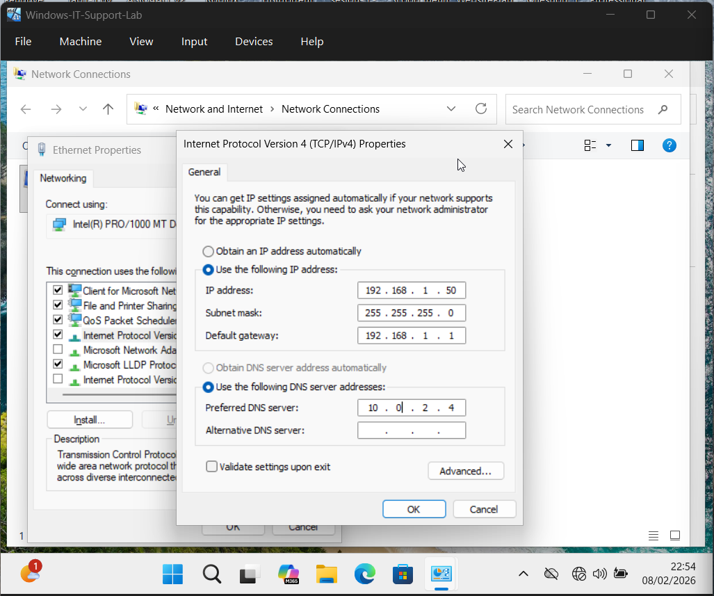
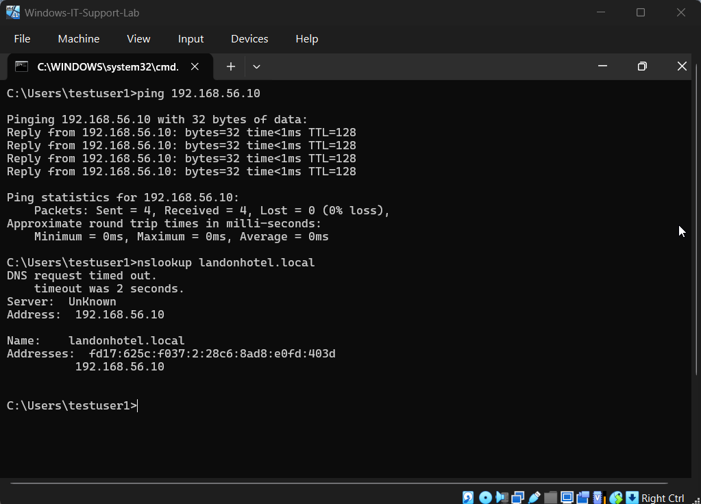

# Ticket-08 — DNS Resolution Failure (Domain-Joined Workstation)

## Objective
Diagnose and resolve a workstation issue where the system was unable to resolve domain and internet hostnames due to incorrect DNS configuration.

---

## Lab Environment

- Hypervisor: VirtualBox
- Client OS: Windows 11 (VM)
- Domain Status: Domain-Joined (landonhotel.local)
- Logged-in User: Local Account (`.\testuser1`)
- Account Created Under: Local Administrator (Thithushan)
- Network Type: NAT / Internal Network
- Tools Used: Command Prompt, Network Adapter Settings, NSLookup

---

## Issue Summary

A workstation user reported that the computer could access network resources via IP address but was unable to resolve domain and internet hostnames. Troubleshooting was performed locally on the domain-joined machine to determine whether the issue was caused by DNS misconfiguration.

---

## Steps Performed

### 1) Simulate DNS Misconfiguration

- Opened Network Adapter Settings  
- Accessed IPv4 Properties  
- Configured incorrect DNS server manually  

**Configuration Applied:**

IP Address: 192.168.1.50  
Subnet Mask: 255.255.255.0  
Default Gateway: 192.168.1.1  
Preferred DNS Server: 1.1.1.1  

This configuration intentionally prevented proper hostname resolution.

**Screenshots:**

---

### 2) Verify DNS Configuration

Executed:

`ipconfig /all`

Observed that the workstation was using an external DNS server instead of the Domain Controller DNS, confirming misconfiguration.

**Screenshots:**

---
s
### 3) Test Name Resolution Failure

Executed external resolution test:

`ping google.com`

Result: Hostname resolution failed.

Executed domain resolution test:

`nslookup landonhotel.local`

Result: DNS query failed due to incorrect DNS server assignment.

**Screenshots:**

---

## Root Cause

The workstation was configured with an incorrect DNS server. Domain-joined systems must use the Domain Controller’s DNS service to resolve internal domain resources. Using external DNS prevented hostname resolution and domain service discovery.

---

## Resolution Steps

### 4) Reconfigure Correct DNS Server

- Reopened IPv4 Properties  
- Updated DNS configuration  

**Correct Settings Applied:**

Preferred DNS Server: `<Domain Controller IP>`  
(Example: 10.0.2.4)

This ensured domain DNS services were reachable.

**Screenshots:**

---

### 5) Flush and Renew DNS Records

Executed:

`ipconfig /flushdns`  
`ipconfig /renew`

This cleared cached DNS entries and refreshed network configuration.

---

### 6) Validate DNS Resolution

Executed:

`nslookup landonhotel.local`

Observed successful resolution from the Domain Controller DNS server.

Executed connectivity validation:

`ping landonhotel.local`

Confirmed hostname resolution and domain reachability.

**Screenshots:**

---

## Validation

- Verified correct DNS server assignment  
- Confirmed internal domain name resolution  
- Confirmed hostname reachability via ping  
- Confirmed Domain Controller discovery  

---

## Outcome

Successfully diagnosed and resolved the DNS resolution failure by correcting DNS server configuration and restoring domain name resolution services on the workstation.
