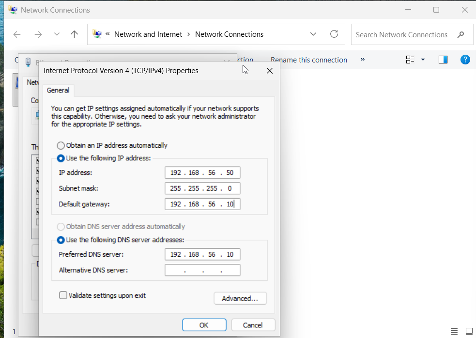
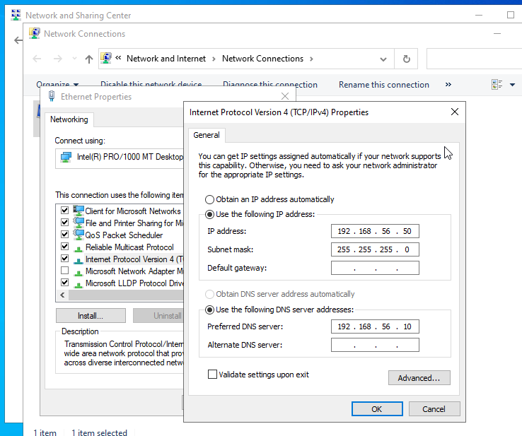
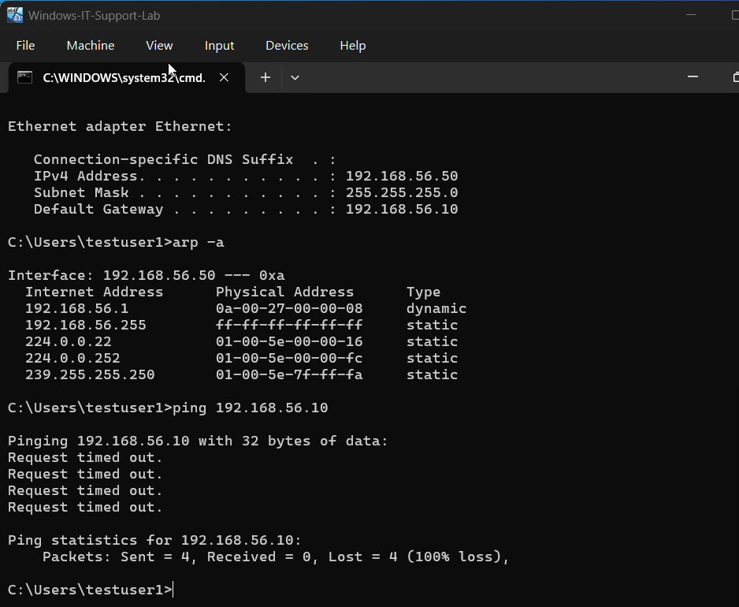
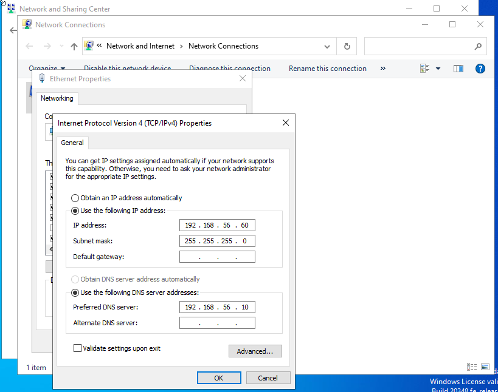
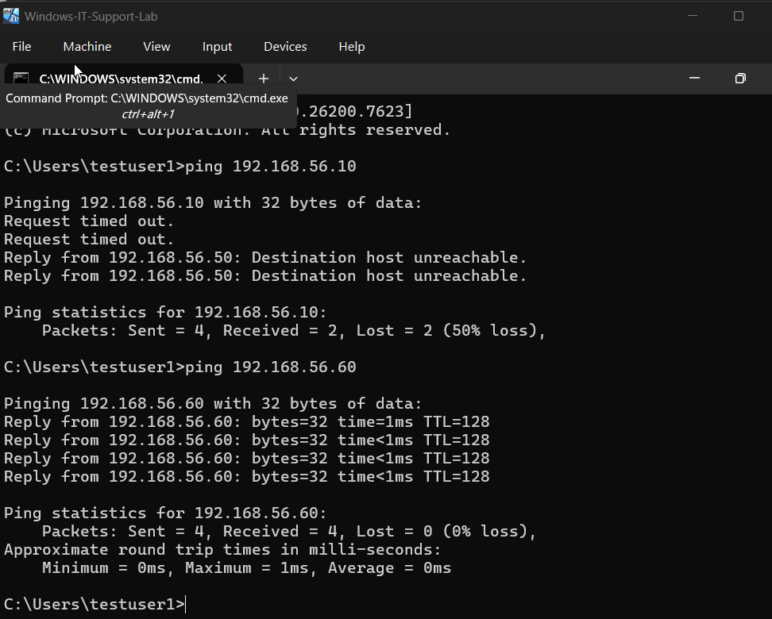

# Ticket-09 — IP Address Conflict (Host-Only Network)

## Objective
Diagnose and resolve an IP address conflict where two machines were configured with the same IPv4 address, causing intermittent connectivity issues.

---

## Lab Environment

- Hypervisor: VirtualBox
- Client OS: Windows 11 (VM)
- Server OS: Windows Server (Domain Controller — DC-1)
- Network Type: Host-Only Adapter (192.168.56.0/24)
- Domain: landonhotel.local
- Tools Used: Command Prompt, Network Adapter Settings, ARP

---

## Issue Summary

A workstation experienced intermittent network connectivity. Investigation revealed the workstation was sharing the same IPv4 address with another machine on the same network — in this case, the Domain Controller — resulting in an IP address conflict.

---

## Steps Performed

### 1) Simulate IP Conflict

- Configured Client VM with a static IPv4 address
- Temporarily configured the Domain Controller VM with the same IPv4 address for lab simulation

**Configuration Applied (both machines):**

IP Address: 192.168.56.50  
Subnet Mask: 255.255.255.0  

**Screenshots:**

---

### 2) Observe Conflict Symptoms

Executed:

`ipconfig`  
`arp -a`  
`ping 192.168.56.10`  

Observed conflict symptoms such as intermittent connectivity loss and failed communication with the Domain Controller.

**Screenshots:**

---

## Root Cause

Two machines on the same network segment were configured with the same IPv4 address. This duplication caused ARP conflicts, resulting in unstable communication and packet delivery failures.

---

## Resolution Steps

### 3) Assign a Unique IP Address

- Restored the Domain Controller to its original unique IPv4 address to eliminate duplication

**Fixed Configuration (Domain Controller):**

IP Address: 192.168.56.60  
Subnet Mask: 255.255.255.0  

**Screenshots:**

---

### 4) Validate Connectivity Restoration

Executed:

`ping 192.168.56.10`  
`ping 192.168.56.60`  

Observed stable replies confirming the IP conflict was resolved and normal network communication restored.

**Screenshots:**

---

## Validation

- Confirmed each machine had a unique IPv4 address
- Confirmed restored communication with the Domain Controller
- Confirmed elimination of packet loss and instability

---

## Outcome

Successfully diagnosed and resolved an IP address conflict by identifying duplicate addressing and restoring unique IPv4 configuration, ensuring stable network communication within the domain environment.
