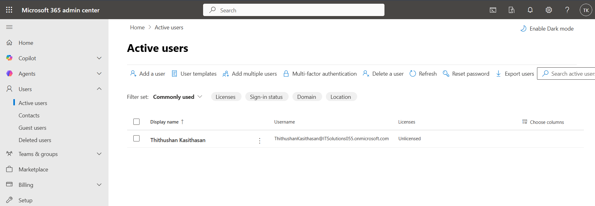
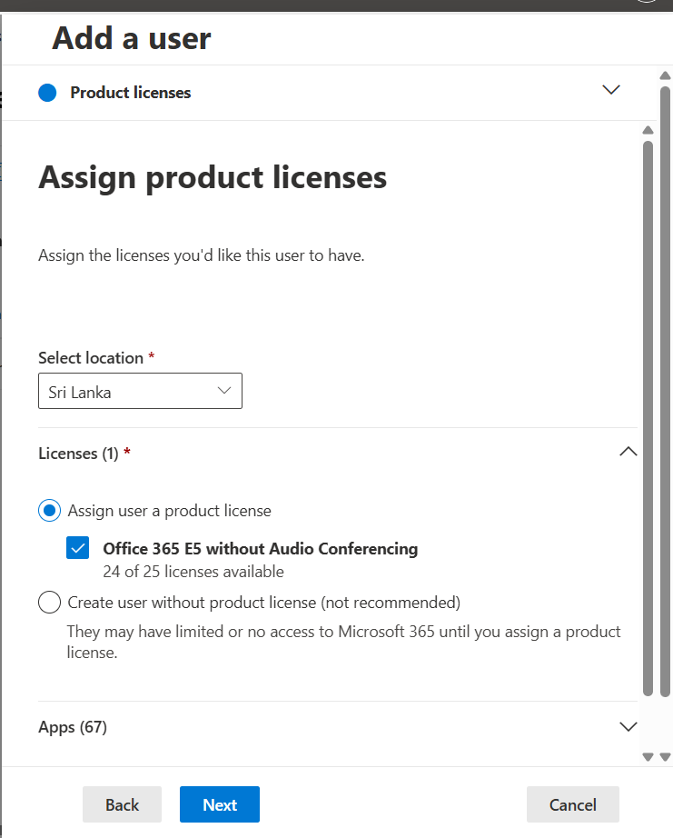
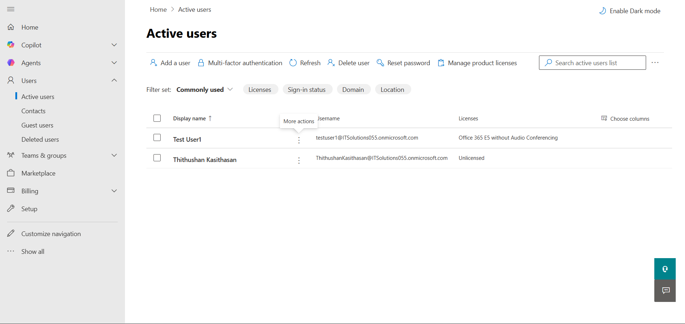
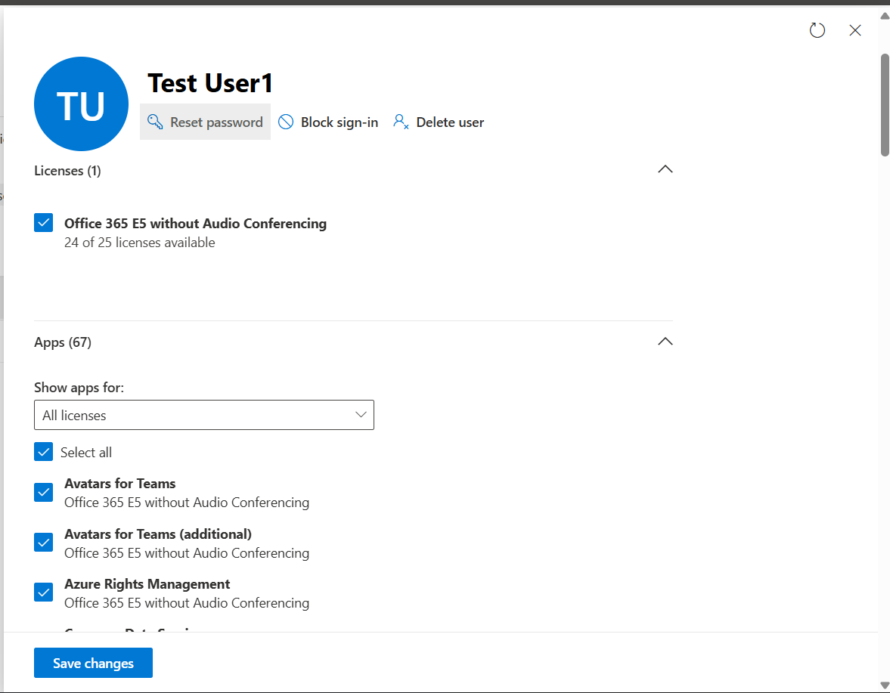

# Ticket-12 — User Creation & License Assignment

## Objective
Simulate onboarding of a new employee by creating a Microsoft 365 user account and assigning appropriate licensing to enable access to enterprise services.

---

## Lab Environment

- Platform: Microsoft 365 Admin Center
- Tenant Type: Microsoft 365 E5 Trial
- Admin Portal: https://admin.microsoft.com
- License: Microsoft 365 E5 Trial Subscription

---

## Issue Summary

The IT Helpdesk received a request to provision a new user account and assign the required Microsoft 365 license to enable access to enterprise communication and collaboration services such as Outlook, Teams, and OneDrive.

---

## Steps Performed

### 1) Review Existing Users

Navigated to:

Users → Active Users

Reviewed the tenant user list prior to onboarding.

**Screenshot:**

---

### 2) Create New User Account

Configured new user identity details including display name, username, and password settings.

**Screenshot:**

---

### 3) Assign Microsoft 365 License

Assigned Microsoft 365 E5 Trial license to enable enterprise service access.

**Screenshot:**

---

### 4) Confirm User Provisioning

Verified successful account creation via provisioning confirmation screen.

**Screenshot:**

---

### 5) Validate User Visibility

Confirmed the newly created user appeared in the **Active Users** directory with an assigned license.

**Screenshot:**

---

### 6) Verify License & Service Access

Reviewed assigned services and licensing details within the user profile.

**Screenshot:**

---

## Validation

- User account successfully provisioned
- License assigned and visible
- User listed within Active Users directory
- Services enabled based on license assignment

---

## Outcome

Successfully onboarded a new Microsoft 365 user and assigned licensing required for enterprise productivity and collaboration services.
