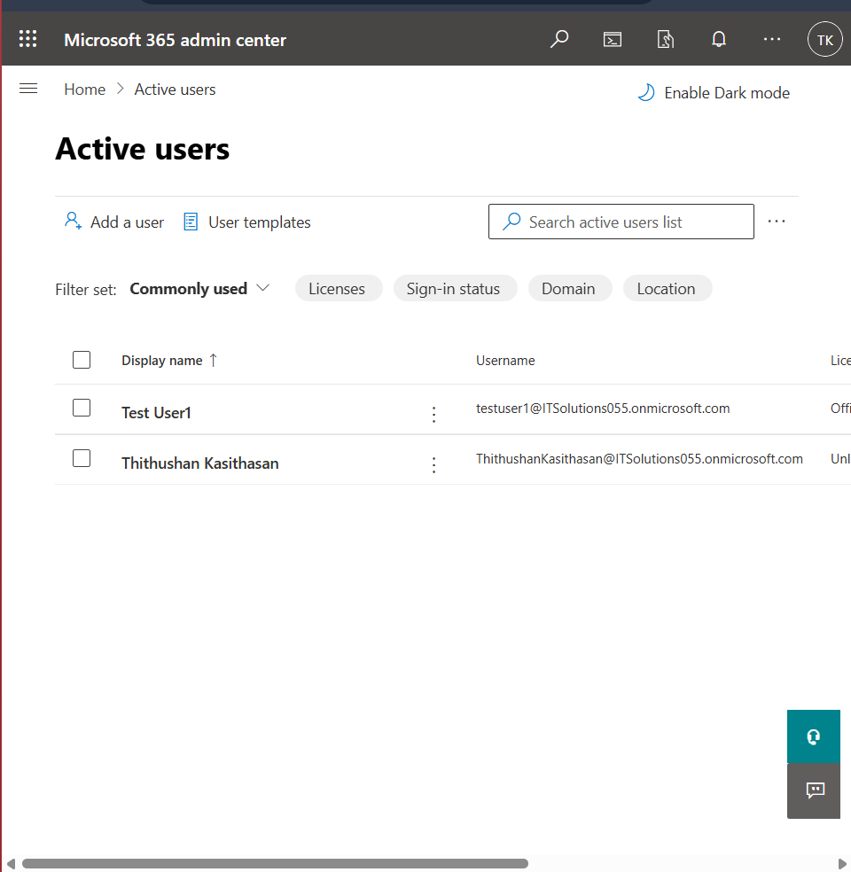
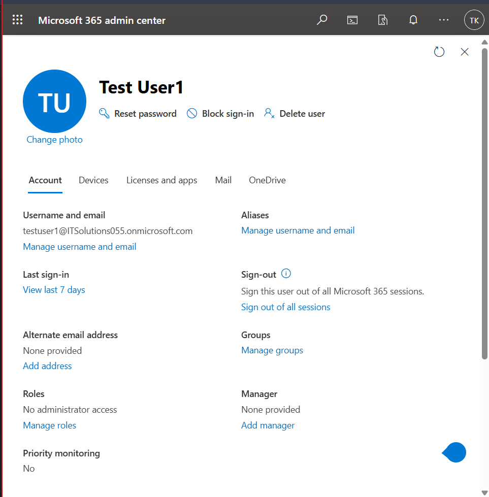
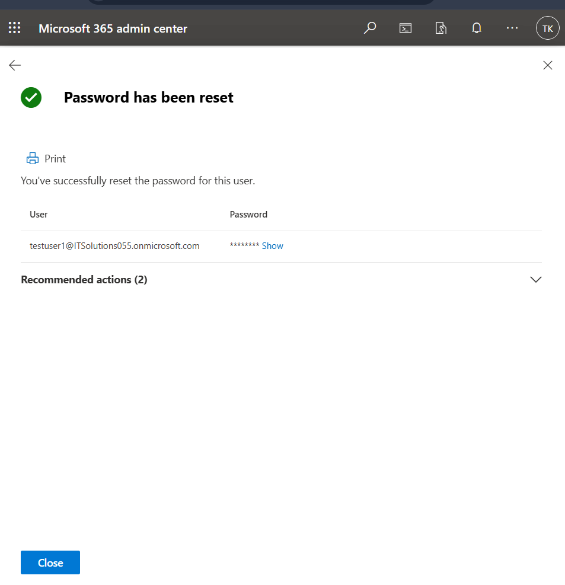
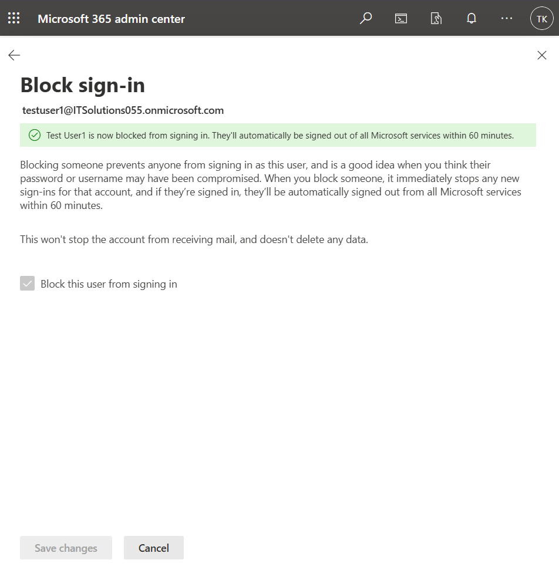
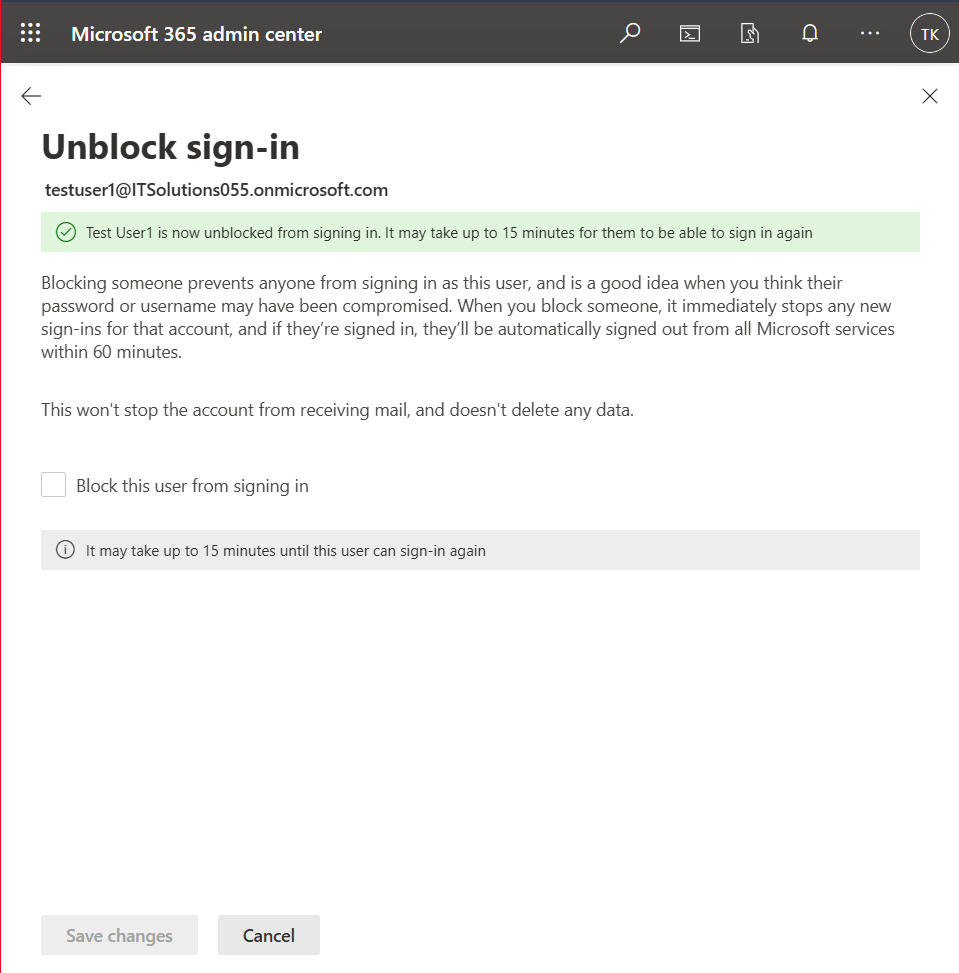

# Ticket-13 — Password Reset & Account Unlock

## Objective
Simulate a helpdesk support request involving password reset and restoration of user account access within Microsoft 365.

---

## Lab Environment

- Platform: Microsoft 365 Admin Center
- Tenant Type: Microsoft 365 E5 Trial
- Admin Portal: https://admin.microsoft.com

---

## Issue Summary

A user reported being unable to log in to their Microsoft 365 account due to a forgotten password and possible account lockout.

---

## Steps Performed

### 1) Identify Affected User

Navigated to:

Users → Active Users

Located the affected account.

**Screenshot:**

---

### 2) Access User Account Settings

Opened user profile to review account configuration options.

**Screenshot:**

---

### 3) Perform Password Reset

Initiated password reset and generated a temporary password requiring change at next sign-in.

**Screenshot:**

---

### 4) Simulate Account Lockout

Enabled sign-in block to simulate account access restriction.

**Screenshot:**

---

### 5) Restore Account Access

Disabled sign-in block to re-enable user authentication.

**Screenshot:**

---

## Validation

- Password successfully reset
- Temporary credentials generated
- Account sign-in restriction simulated
- Access successfully restored

---

## Outcome

User account access was restored through password reset and sign-in re-enablement, resolving the login issue.
