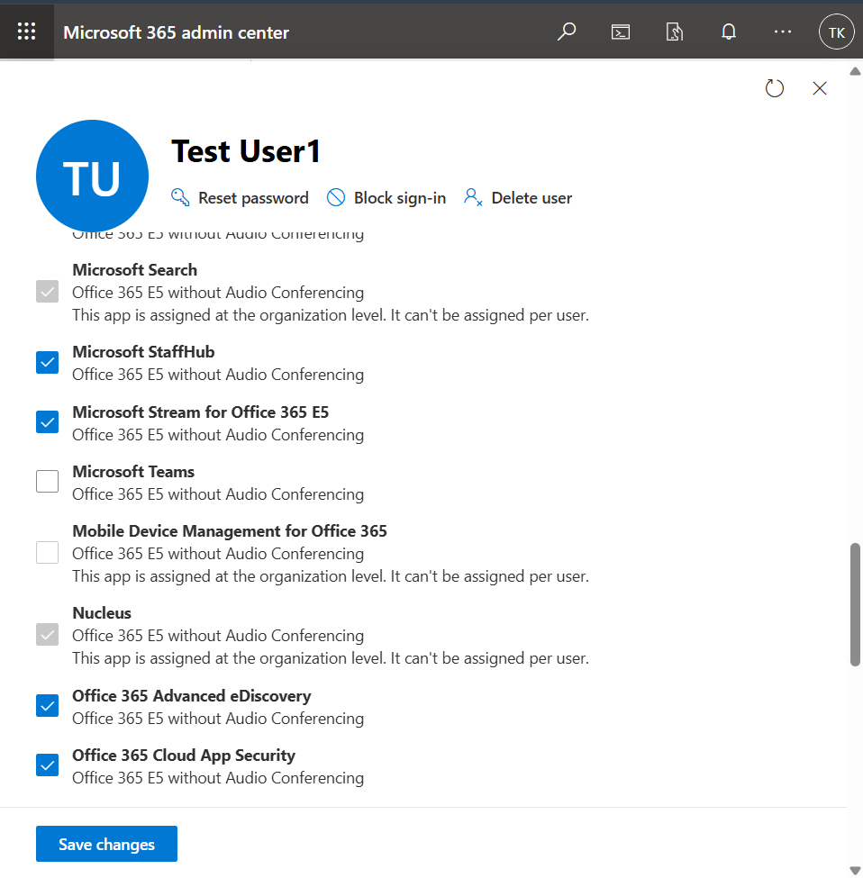
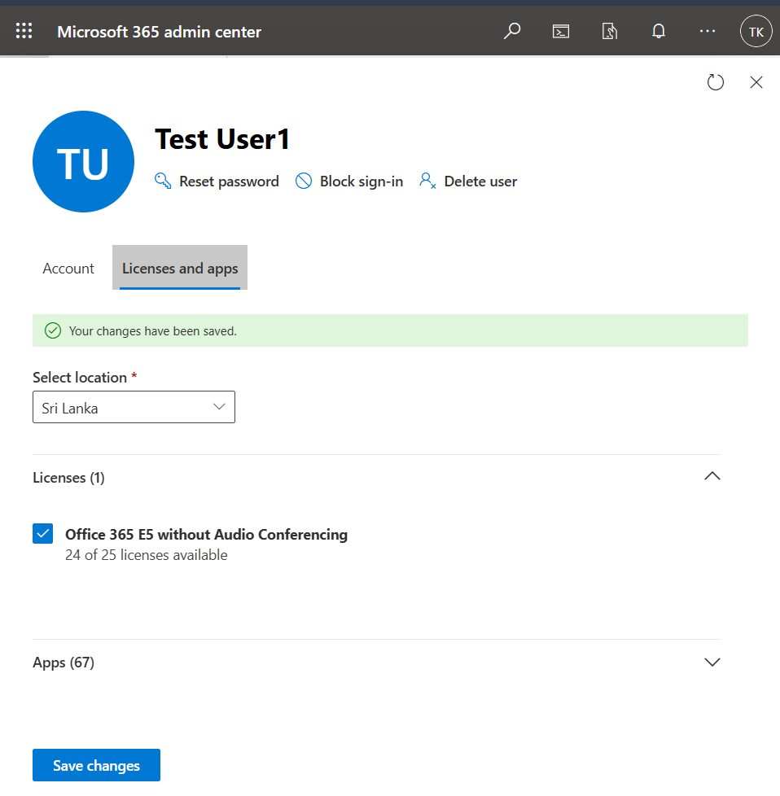
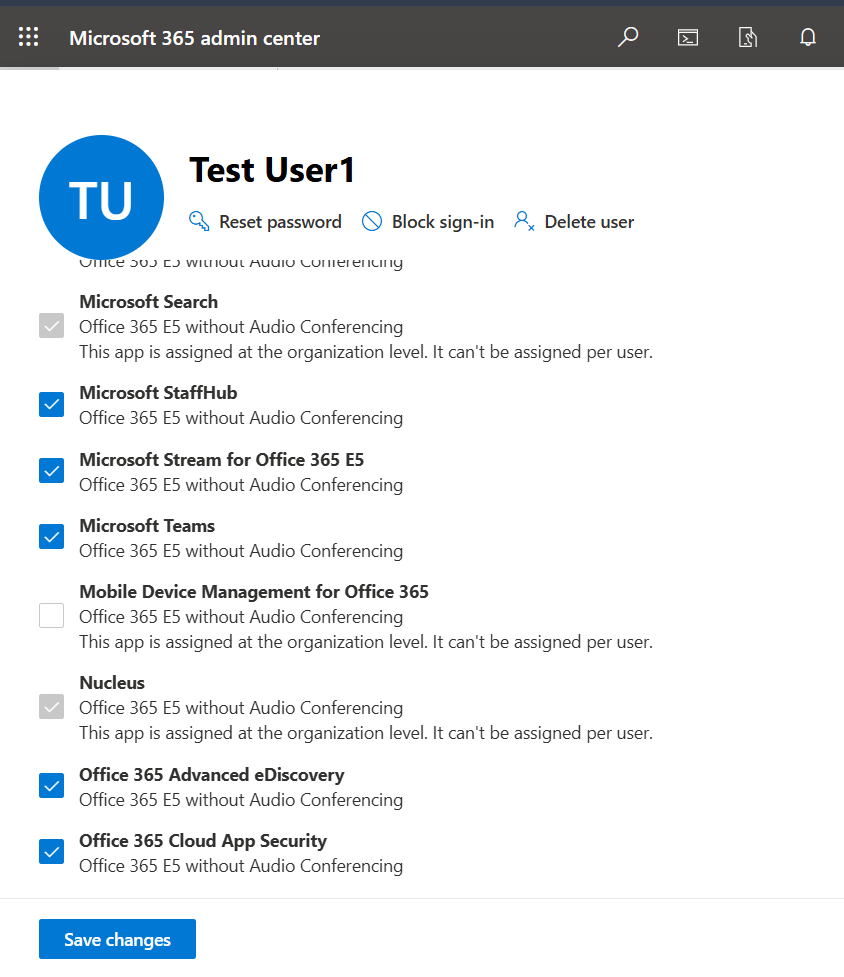

# Ticket-14 — Microsoft Teams Access Issue

## Objective
Diagnose and resolve a Microsoft Teams access issue caused by disabled service assignment within a licensed Microsoft 365 user account.

---

## Lab Environment

- Platform: Microsoft 365 Admin Center
- Tenant Type: Microsoft 365 E5 Trial
- Admin Portal: https://admin.microsoft.com

---

## Issue Summary

A user reported being unable to access Microsoft Teams despite having an active Microsoft 365 license assigned.

---

## Steps Performed

### 1) Review License Service Assignment

Navigated to the user’s license and application services list and verified Microsoft Teams was enabled.

**Screenshot:**

---

### 2) Simulate Service Access Failure

Disabled Microsoft Teams service under the assigned license to reproduce the reported issue.

**Screenshot:**

---

### 3) Re-Enable Teams Service

Reactivated Microsoft Teams within the license service configuration.

**Screenshot:**

---

### 4) Validate Service Restoration

Confirmed Microsoft Teams service was successfully restored for the user.

**Screenshot:**

---

## Validation

- License assignment verified
- Service disablement reproduced access issue
- Service re-enabled successfully
- Teams access restored

---

## Outcome

Microsoft Teams access was restored by re-enabling the service within the assigned Microsoft 365 license configuration.
