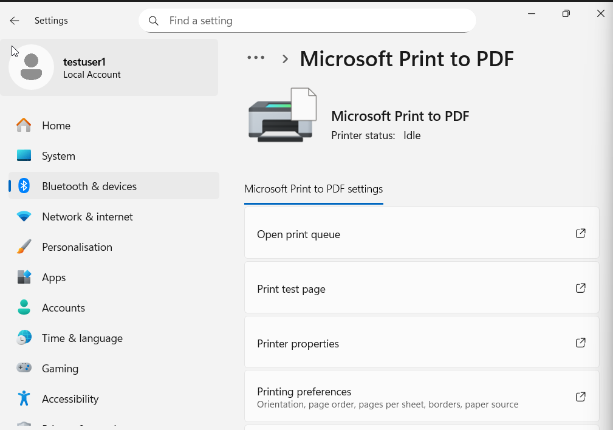
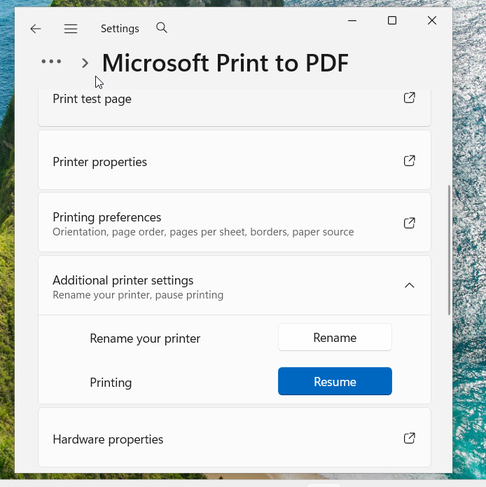
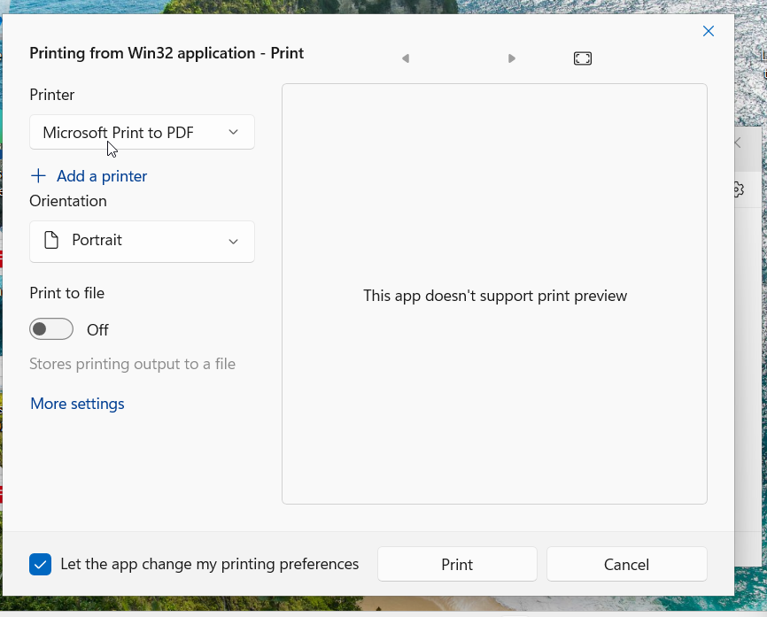
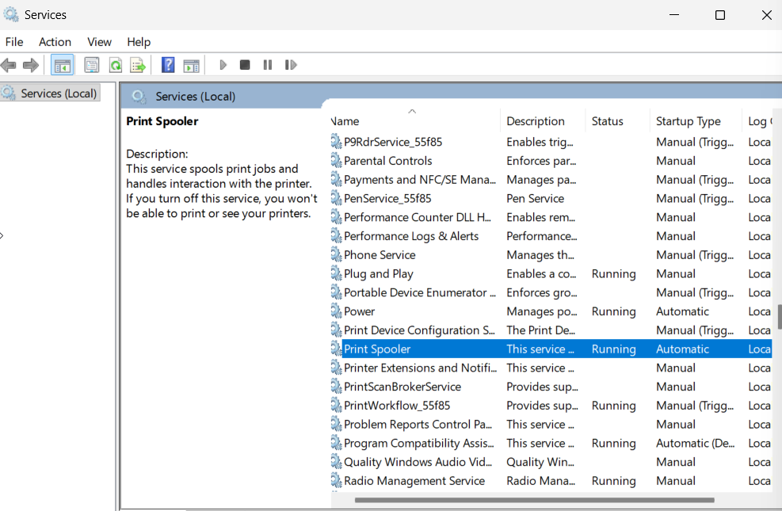
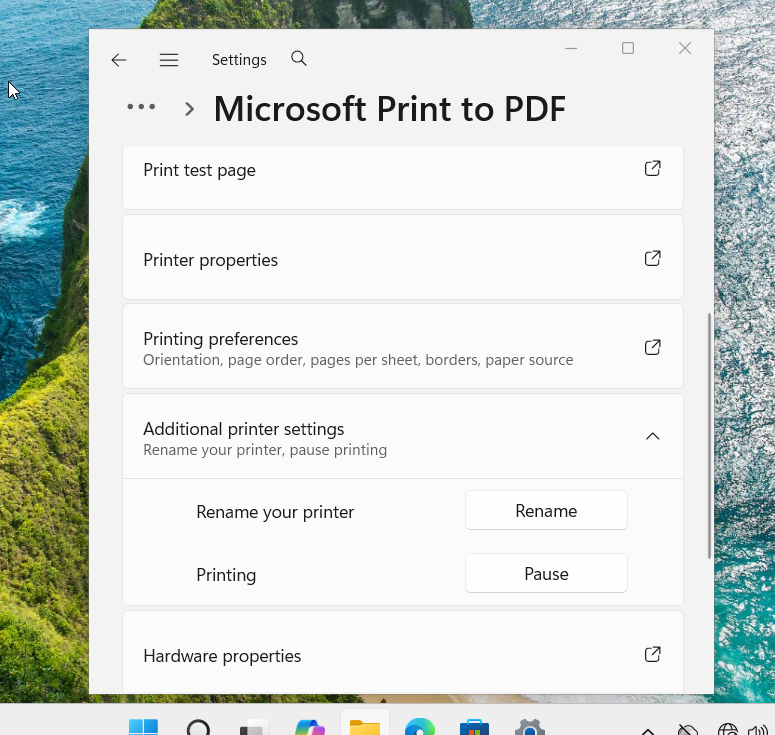
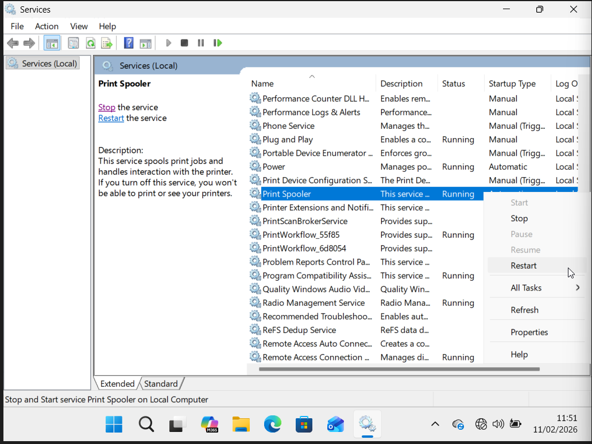

# Ticket-19 — Printer Not Processing Jobs (Paused Printer State)

## Objective
Diagnose and resolve a printing interruption caused by the printer being placed in a paused state while the Print Spooler service remained operational.

---

## Lab Environment

- Operating System: Windows 10 / Windows 11
- Device Type: Client Workstation (VM)
- Printer Type: Microsoft Print to PDF
- User Context: Standard Local User
- Admin Context: Local Administrator

---

## Issue Summary

A user reported printing interruptions where documents were not processing normally despite the printer appearing installed and available.

---

## User Impact Validation

### 1) Verify Printer Installation

Navigated to:

Settings → Bluetooth & devices → Printers & scanners

Confirmed Microsoft Print to PDF was installed.

**Screenshot:**  

---

### 2) Pause Printer to Simulate Issue

Accessed additional printer settings and paused printing operations.

**Screenshot:**  

---

### 3) Attempt Test Print

User attempted to print a document while the printer was paused.

Print dialog still generated output prompt due to virtual printer behavior.

**Screenshot:**  

---

## Administrative Troubleshooting

### 4) Verify Spooler Service

Checked service status via services.msc.

Confirmed Print Spooler was running.

**Screenshot:**  

---

### 5) Resume Printer Operation

Resumed printer processing from paused state.

**Screenshot:**  

---

### 6) Restart Spooler Service

Restarted Print Spooler service as a preventive remediation step.

**Screenshot:**  

---

## Resolution Validation

### 7) Perform Test Print

User successfully printed and saved a document after remediation.

**Screenshot:**  

---

## Root Cause

Printer was placed in a paused operational state, interrupting normal print processing.

---

## Resolution

Resumed printer operations and validated spooler functionality.

---

## Outcome

Printing services restored successfully.

---

## Key Learning

- Printer operational states impact print processing
- Difference between paused printers and spooler failures
- Virtual printer behavior in troubleshooting labs
- Service validation in print incidents
