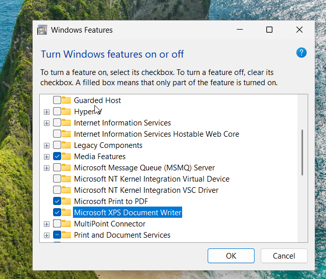
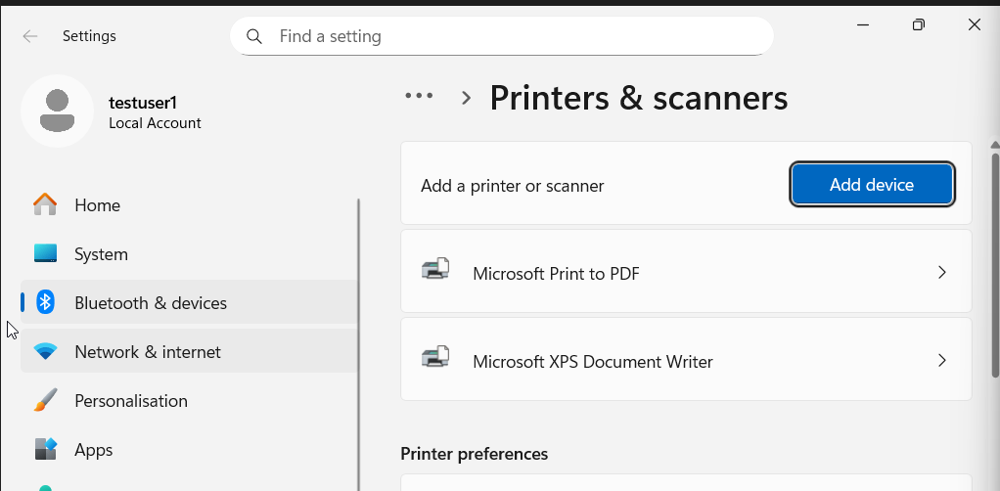
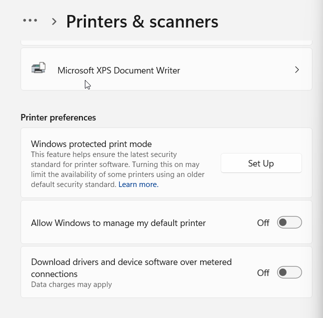
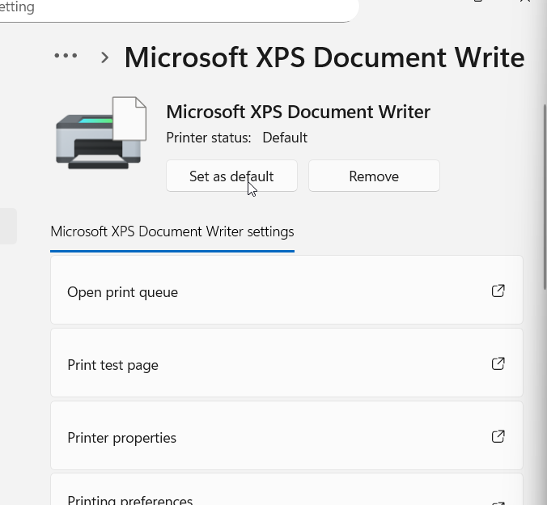
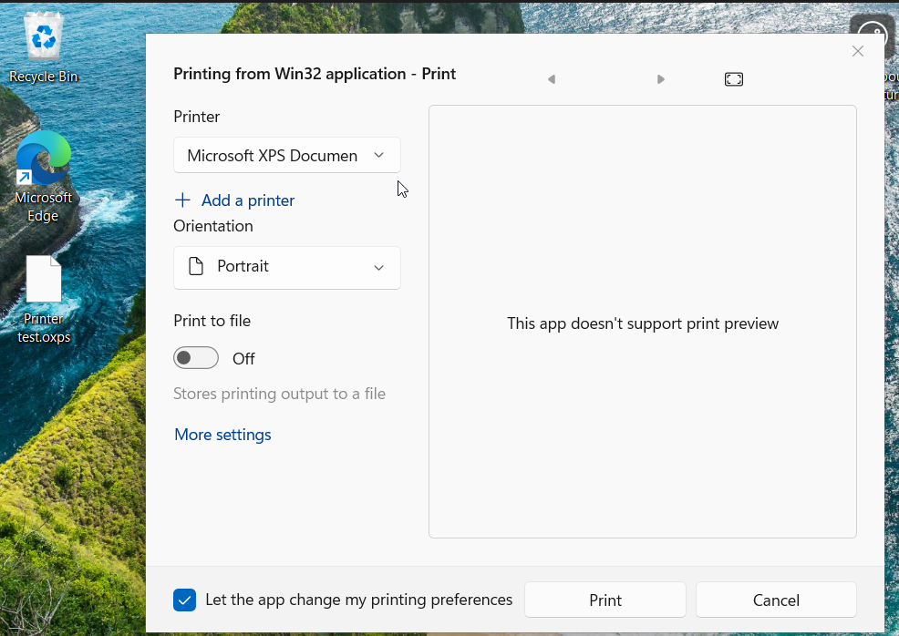
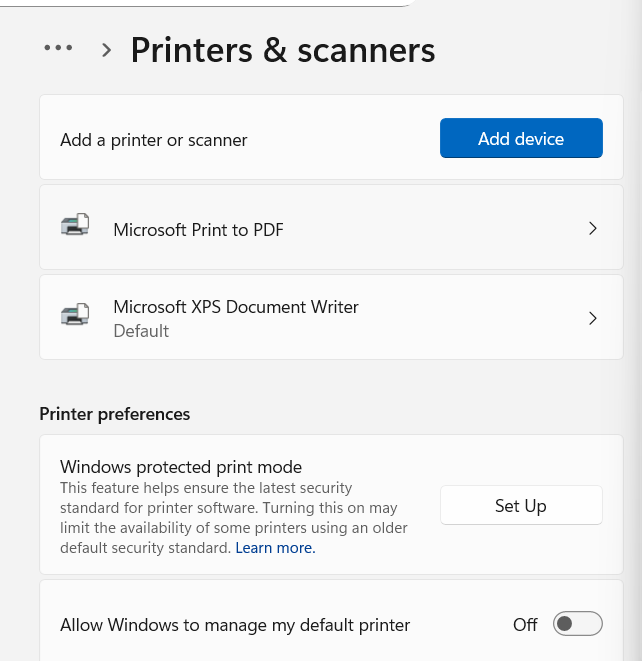
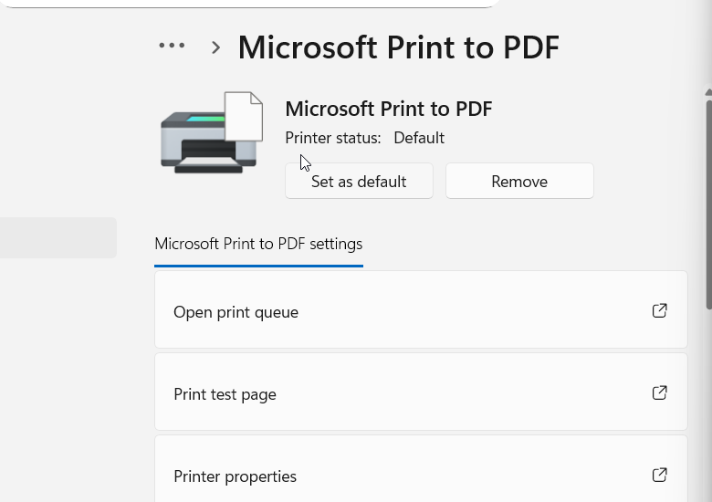
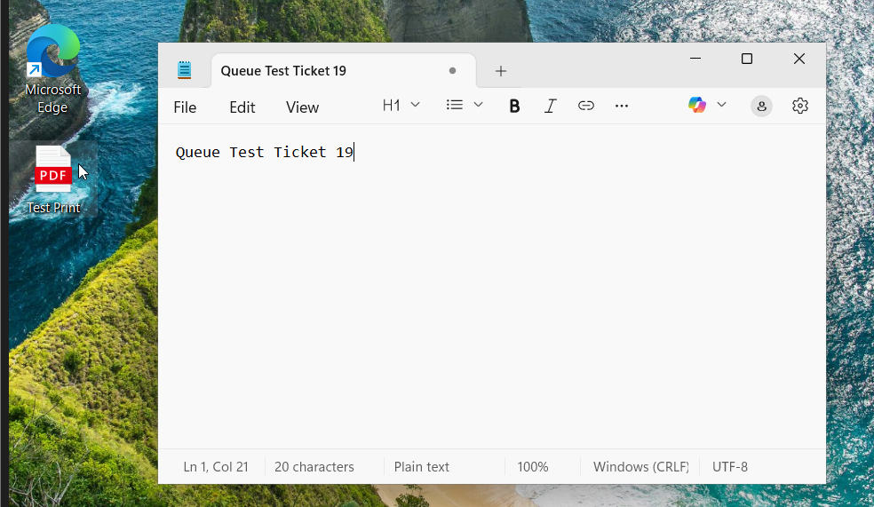

# Ticket-21 — Wrong Default Printer (Print Routing Issue)

## Objective
Diagnose and resolve a printing issue caused by incorrect default printer configuration.

---

## Lab Environment

- Operating System: Windows 10 / Windows 11
- Device Type: Client Workstation (VM)
- Printers Used:
  - Microsoft Print to PDF
  - Microsoft XPS Document Writer
- User Context: Standard Local User

---

## Issue Summary

A user reported that printed documents were not generating expected output due to incorrect printer routing.

---

## Environment Preparation

### 1) Enable Secondary Printer

Enabled Microsoft XPS Document Writer via Windows Features.

**Screenshot:**  

---

### 2) Verify Printer Availability

Confirmed both printers were installed.

**Screenshot:**  

---

### 3) Disable Automatic Default Assignment

Turned off Windows automatic default printer management.

**Screenshot:**  

---

## Issue Simulation

### 4) Set Wrong Default Printer

Configured XPS Writer as default.

**Screenshot:**  

---

### 5) Attempt Printing

User printed document which routed to XPS output instead of PDF.

**Screenshot:**  

---

## Troubleshooting

### 6) Review Default Configuration

Verified incorrect default printer assignment.

**Screenshot:**  

---

### 7) Restore Correct Default Printer

Set Microsoft Print to PDF as default.

**Screenshot:**  

---

## Resolution Validation

### 8) Perform Test Print

User successfully printed to correct PDF output.

**Screenshot:**  

---

## Root Cause

Incorrect default printer configuration caused print routing issues.

---

## Resolution

Reconfigured default printer to the appropriate output device.

---

## Outcome

Printing functionality restored successfully.

---

## Key Learning

- Default printer routing troubleshooting
- User configuration validation
- Output path analysis
- Endpoint printer management
