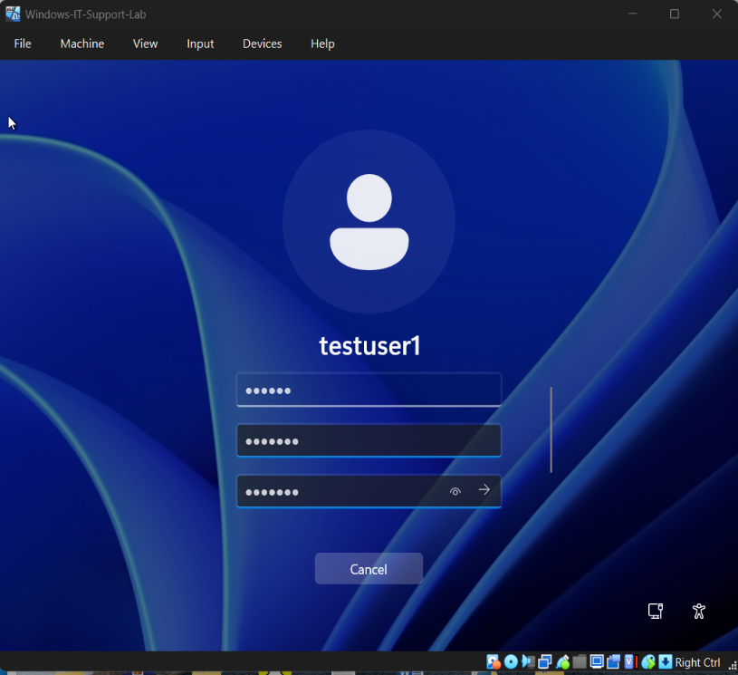

# Ticket 01 – User Unable to Log In

## Issue Summary
A user reported that they were unable to log into their Windows account due to repeated incorrect password attempts.

---

## Environment
- Operating System: Windows 10 / 11
- Account Type: Local User Account
- Access Method: Physical workstation login

---

## User Problem
The user was unable to access their system because the login password was not being accepted.

---

## Questions Asked
To understand the issue, the following questions were asked:

- What is the username?
- When was the last successful login?
- Is Caps Lock enabled?
- Were there any recent password changes?

---

## Checks Performed
The following troubleshooting checks were conducted:

- Verified user account status in **Computer Management**
- Checked whether the account was locked or disabled
- Confirmed login failure behavior

---

## Root Cause
The user entered an incorrect password multiple times, resulting in login failure.

---

## Resolution Steps

1. Logged in using the Administrator account  
2. Opened **Computer Management**  
3. Navigated to **Local Users and Groups**  
4. Selected the affected user account  
5. Reset the user password  
6. Saved changes and exited  

---

## Evidence

### Password Reset Process

### Successful Login Confirmation

---

## Result
The user was able to log in successfully after the password was reset.

---

## Prevention / Best Practices

- Educate users on password policies
- Encourage use of password managers
- Avoid repeated incorrect login attempts
- Verify Caps Lock status before escalation

---

## Tools Used

- Computer Management
- Local Users and Groups
- Windows Administrator Account

