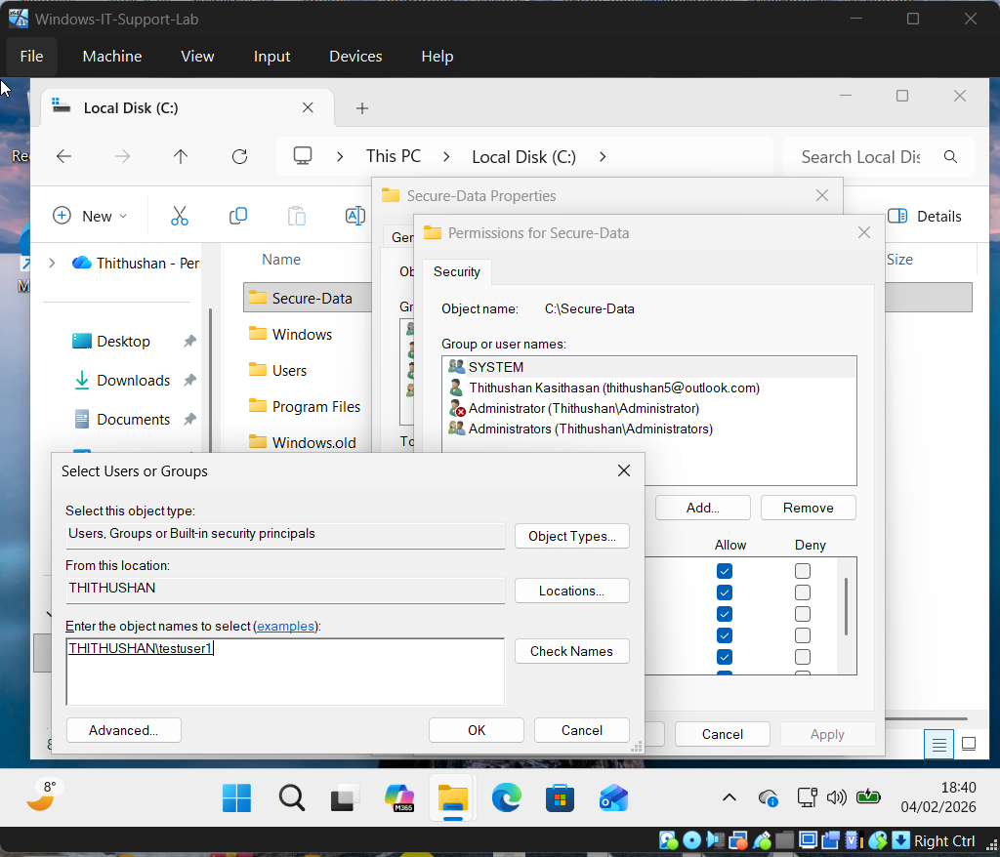
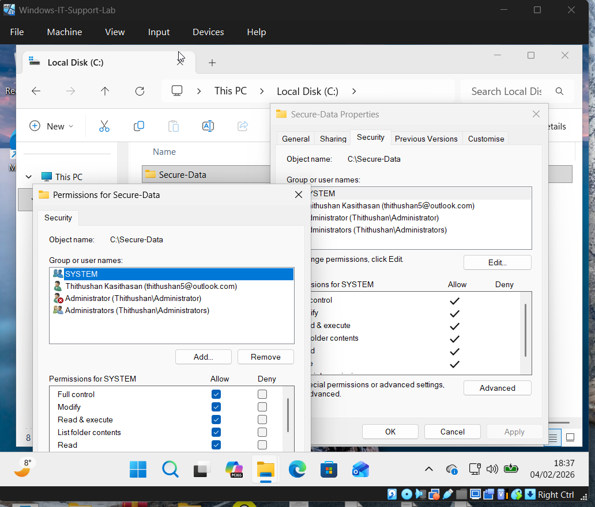
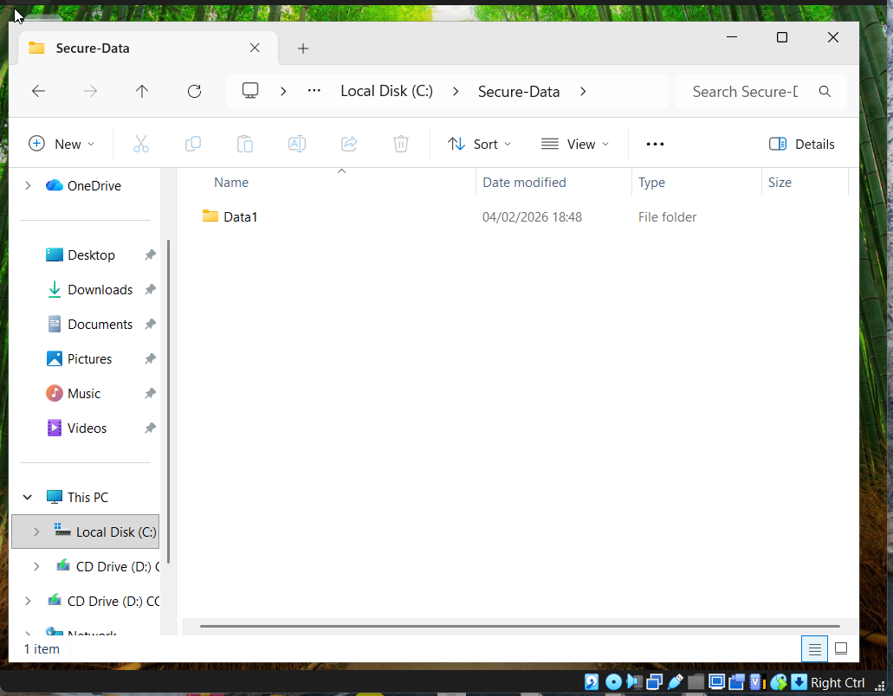

# Ticket 06 – Unauthorized Folder Access (NTFS Permissions)

## Issue Summary
A user reported being unable to access a protected folder and received an “Access Denied” message.

---

## Environment
- Operating System: Windows 10 / 11
- File System: NTFS
- Folder Name: Secure-Data
- User Account: testuser1

---

## User Problem
The user (testuser1) was unable to open or access the protected folder due to permission restrictions.

---

## Checks Performed
The following troubleshooting checks were conducted:

- Reviewed NTFS permissions on the Secure-Data folder
- Verified user access rights
- Confirmed permission inheritance settings

---

## Root Cause
The user did not have sufficient permissions assigned to access the folder.

---

## Resolution Steps

1. Logged in using Administrator account  
2. Navigated to the **Secure-Data** folder  
3. Opened **Folder Properties**  
4. Accessed the **Security** tab  
5. Modified NTFS permissions  
6. Granted **Read access** to testuser1  
7. Applied changes and confirmed settings  
8. Tested folder access with the user account  

---

## Evidence

### Granting Folder Access

### Modifying NTFS Permissions

### Access Verification Successful

---

## Result
User access was successfully restored, and testuser1 was able to open the protected folder.

---

## Security Consideration

Access was granted following the **principle of least privilege**, ensuring the user received only the minimum permissions required.

---

## Prevention / Best Practices

- Assign permissions based on role requirements
- Follow least-privilege access principles
- Regularly audit NTFS permissions
- Avoid granting full control unless necessary

---

## Tools Used

- Windows Folder Properties
- NTFS Permissions Manager
- Security Tab Configuration
- Administrator Account
